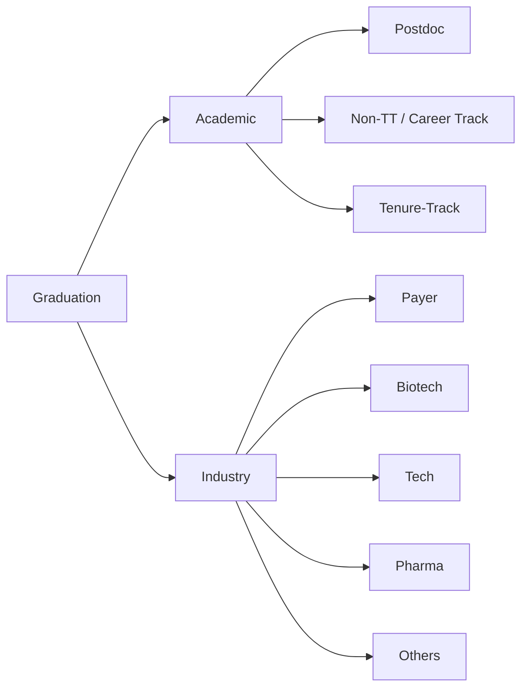

## Overview

---

## Academic

### Tenure-Track

- Soft money vs Hard money 
- R1 / R2 / LAC
- Hiring cycle: ads *Sep–Jan*; interviews *Dec–Mar*; typical start *Aug/Sept* (varies by school)
- Resources:
    - `The professor is in ` by Karen Kelsky
    - `The Academic Job Search Handbook` from Penn
- Application package:
    - Research statement
    - Teaching statement
    - cover letter
    - CV
- Build your portfolio duing PhD
    - Lecture / TA
    - Publication
    - Grantsmanship: NIH F grant, foundation grant
    - Make yourself known by the community

### Non Tenure-Track

- Teaching / Research
- On one PI or multiple-PIs' grants if research track
- Pathway to TT
- Hiring cycle, similar to TT
- Personal choice, doesn't mean non-TT is worse than TT
- Build your portfolio duing PhD
    - Lecture / TA, if teaching track
    - Grantsmanship: NIH F grant, foundation grant, support your PI in their proposal
    - Make yourself known by the community

### Postdoc

- Academic postdoc vs. Industry postdoc
- Does the adviosr encourage independence?
- NIH K99/R00
- Hiring cycle: ads spread out the years
- Staying in the same lab or move to somewhere else
- Build your portfolio duing PhD
    - Know where your research interest is
    - Connect with your potential postdoc PI or bigname in the field
- What is next?

## Industry

### Pharama

- Example employer: Merck, Eli Lilly
- Example position: data scientist, biostatistician
- Reasonable pay and good work life balance, but has the risk of let-go
- Hiring cycle: throughout the year, but being look-out from Sept
- Interview:
    - Call with HR/hiring director
    - Job talk on your research
- Build your portfolio duing PhD
    - Try doing an intership and seek returning opportunity
    - Networking on conference / linkedin and see referral
    - Publications

### BioTech

- Example employer: Flatiron, Tempus AI
- Example position: data scientist, AI scientists
- Pay slightly better than Pharma, working load is prbly heavier but also has the risk of let-go
- Hiring cycle: throughout the year, but being look-out from Sept
- Interview:
    - Call with HR/hiring director
    - Job talk on your research
    - Coding test or case study
- Build your portfolio duing PhD
    - Try doing an intership and seek returning opportunity
    - Networking on conference / linkedin and seek referral
    - Coding test (Leetcode) or case study
    - Publications on applications or methodlogy breakthrough
 
### Payer

- Example employer: BCBS, KP
- Example position: data scientist, AI scientists, data analyst
- Pay slightly worse than or similar to Pharma
- Hiring cycle: throughout the year, but being look-out from Sept
- Interview:
    - Call with HR/hiring director
    - Job talk on your research
    - Coding test or case study
- Build your portfolio duing PhD
    - Networking on conference / linkedin and seek referral
    - Coding test (Leetcode) or case study
    - Publications on claims data
 
### Tech

- Example employer: Google, Meta
- Example position: research scientist, software engineer
- The best pay, but the highest risk of let-go
- Hiring cycle: throughout the year, but being look-out from Sept
- Interview:
    - Call with HR/hiring director
    - Multiple rounds of coding test
- Build your portfolio duing PhD
    - INTERNSHIP
    - Networking on linkedin and seek referral
    - Leetcode
    - Publications on AI conferences
 
### Others
- Startup
- Consulting
- Government
- Take a break

